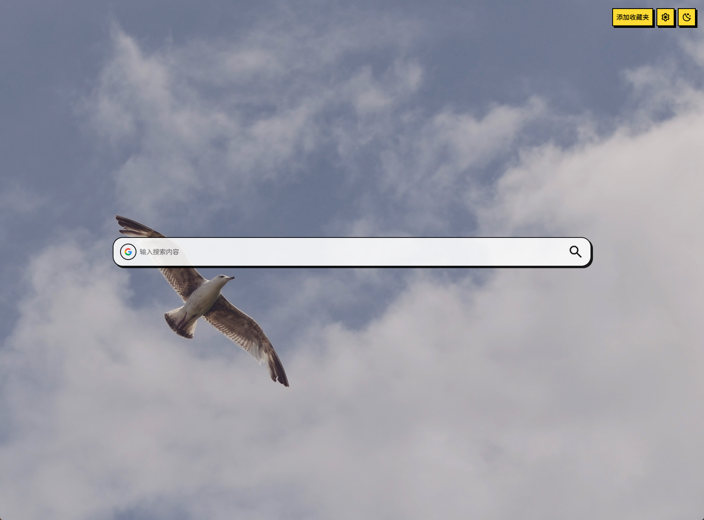

# Fan New Tab 新标签页

<div align="center">


**A beautiful, customizable new tab extension for modern browsers**

[](https://github.com/fzzv/fan-new-tab)
[](LICENSE)
[](https://vuejs.org/)
[](https://www.typescriptlang.org/)

[English](#english) | [中文](#中文)

</div>

---

## English

### 🌟 Overview

Fan New Tab is a modern, feature-rich browser extension that transforms your new tab experience. Built with Vue 3 and TypeScript, it offers a beautiful interface with powerful customization options, multiple search engines, bookmark management, and various display modes to enhance your browsing productivity.

### ✨ Key Features

- **🔍 Smart Search**: Multi-engine search with customizable search providers
- **📚 Bookmark Management**: Organize and access your favorite sites with custom categories
- **🎨 Theme Customization**: Light/dark mode with custom colors and backgrounds
- **📱 Multiple Display Modes**: Standard, Favorites, and Minimal modes
- **⚡ Fast & Lightweight**: Built with modern web technologies for optimal performance
- **🔧 Highly Customizable**: Extensive settings for personalizing your experience

### 📸 Screenshots

#### Standard Mode

*Clean interface with search bar and organized site grid*

#### Settings Panel

*Comprehensive customization options*

### 🛠️ Tech Stack

- **🥝 [Vue 3](https://vuejs.org/)** - Progressive JavaScript framework
- **🦾 [TypeScript](https://www.typescriptlang.org/)** - Type-safe JavaScript
- **🧱 [Vite](https://vite.dev/)** - Fast build tool and dev server
- **🎨 [TailwindCSS](https://tailwindcss.com/)** - Utility-first CSS framework
- **🔍 [Iconify](https://iconify.design/)** - Comprehensive icon library
- **📦 [Dexie.js](https://dexie.org/)** - IndexedDB wrapper for data storage

### 🚀 Detailed Features

#### 🔍 Search Functionality
- **Multi-Engine Support**: Google, Bing, Baidu, Yandex, and more
- **Custom Search Engines**: Add your own search providers
- **Customizable Search Bar**: Adjust size, style, opacity, and border radius
- **Keyboard Shortcuts**: Quick search with `Ctrl+Shift+K` (or `Cmd+Shift+K` on Mac)

#### 📚 Bookmark Management
- **Organized Collections**: Create custom categories for your bookmarks
- **Browser Sync**: Import bookmarks directly from your browser
- **Drag & Drop**: Reorder bookmarks and categories easily
- **Quick Access**: One-click access to your favorite sites

#### 🎨 Theme & Customization
- **Light/Dark Mode**: Toggle between themes or auto-detect system preference
- **Custom Backgrounds**: Upload images or use solid colors
- **Background Effects**: Blur and opacity controls
- **Color Themes**: Customize primary colors and accents
- **Responsive Design**: Adapts to different screen sizes

#### 📱 Display Modes
- **Standard Mode**: Search bar with organized site grid
- **Favorites Mode**: Focus on bookmark collections with tabs
- **Minimal Mode**: Clean interface with search bar only

### 📋 Prerequisites

Before installing, make sure you have:

- **Node.js** (version 16 or higher)
- **npm** or **yarn** or **pnpm** package manager
- A modern browser (Chrome, Firefox, Edge, etc.)

### 💻 Installation

#### For Development

1. **Clone the repository**
   ```bash
   git clone https://github.com/fzzv/fan-new-tab.git
   cd fan-new-tab
   ```

2. **Install dependencies**
   ```bash
   npm install
   ```

3. **Start development server**
   ```bash
   npm run dev
   ```

4. **Load extension in browser**
   - Open your browser's extension management page
   - Enable "Developer mode"
   - Click "Load unpacked extension"
   - Select the `extension` folder

#### For Production Build

1. **Build the extension**
   ```bash
   npm run build
   ```

2. **Package the extension**
   ```bash
   npm run pack
   ```

This will create `extension.zip`, `extension.crx`, and `extension.xpi` files for different browsers.

#### Browser-Specific Installation

**Chrome/Edge:**
- Go to `chrome://extensions/` or `edge://extensions/`
- Enable Developer mode
- Click "Load unpacked" and select the `extension` folder

**Firefox:**
- Go to `about:debugging#/runtime/this-firefox`
- Click "Load Temporary Add-on"
- Select the `manifest.json` file in the `extension` folder

### 🌐 Browser Compatibility

| Browser | Version | Status |
|---------|---------|--------|
| Chrome  | 88+     | ✅ Fully Supported |
| Firefox | 89+     | ✅ Fully Supported |
| Edge    | 88+     | ✅ Fully Supported |
| Safari  | 14+     | 🚧 Experimental |

### 📖 Usage Guide

#### Getting Started
1. **First Launch**: After installation, open a new tab to see Fan New Tab
2. **Settings**: Click the settings icon (⚙️) in the top-right corner
3. **Theme Toggle**: Use the sun/moon icon to switch between light and dark modes

#### Adding Bookmarks
1. **Manual Addition**: Click the "+" button to add a new bookmark
2. **Browser Import**: Go to Settings → Import → Sync from Browser
3. **Drag & Drop**: Organize bookmarks by dragging them between categories

#### Customizing Your Experience
1. **Search Engines**: Settings → Search → Add/Remove search engines
2. **Backgrounds**: Settings → Theme → Upload custom background images
3. **Display Mode**: Settings → Display → Choose between Standard, Favorites, or Minimal
4. **Colors**: Settings → Theme → Customize primary colors and accents

#### Keyboard Shortcuts
- `Ctrl+Shift+K` (or `Cmd+Shift+K`): Open command palette
- `Tab`: Navigate between search engines
- `Enter`: Perform search
- `Esc`: Close modals and popups

### 🔧 Development

#### Project Structure
```
fan-new-tab/
├── src/
│   ├── newtab/          # New tab page components
│   ├── popup/           # Extension popup
│   ├── background/      # Background scripts
│   ├── content/         # Content scripts
│   ├── components/      # Reusable UI components
│   ├── composables/     # Vue composables
│   └── types/           # TypeScript type definitions
├── extension/           # Built extension files
├── scripts/             # Build scripts
└── package.json
```

#### Available Scripts

| Command | Description |
|---------|-------------|
| `npm run dev` | Start development server with hot reload |
| `npm run build` | Build for production |
| `npm run pack` | Package extension for distribution |
| `npm run lint` | Run ESLint |
| `npm run typecheck` | Run TypeScript type checking |

#### Development Workflow
1. Make changes to source files in `src/`
2. The development server will automatically rebuild
3. Reload the extension in your browser to see changes
4. Use browser developer tools for debugging

### 🤝 Contributing

We welcome contributions! Here's how you can help:

#### Reporting Issues
- Use the [GitHub Issues](https://github.com/fzzv/fan-new-tab/issues) page
- Provide detailed information about the bug or feature request
- Include screenshots if applicable

#### Pull Requests
1. Fork the repository
2. Create a feature branch: `git checkout -b feature/amazing-feature`
3. Make your changes and test thoroughly
4. Commit with descriptive messages: `git commit -m 'Add amazing feature'`
5. Push to your branch: `git push origin feature/amazing-feature`
6. Open a Pull Request

#### Development Guidelines
- Follow the existing code style
- Add TypeScript types for new features
- Test your changes across different browsers
- Update documentation as needed

### 🐛 Troubleshooting

#### Common Issues

**Extension not loading:**
- Ensure you've selected the correct `extension` folder
- Check that Developer mode is enabled
- Try refreshing the extensions page

**Search not working:**
- Check your internet connection
- Verify search engine URLs in settings
- Clear browser cache and reload

**Bookmarks not syncing:**
- Grant necessary permissions when prompted
- Check browser bookmark permissions
- Try manual import/export

**Performance issues:**
- Reduce background image size
- Disable unnecessary animations in settings
- Clear extension storage data

#### Getting Help
- Check the [FAQ](https://github.com/fzzv/fan-new-tab/wiki/FAQ)
- Search [existing issues](https://github.com/fzzv/fan-new-tab/issues)
- Create a [new issue](https://github.com/fzzv/fan-new-tab/issues/new) with details

### 📄 License

This project is licensed under the MIT License - see the [LICENSE](LICENSE) file for details.

### 🙏 Acknowledgments

- [Vue.js](https://vuejs.org/) - The progressive JavaScript framework
- [Vite](https://vitejs.dev/) - Next generation frontend tooling
- [TailwindCSS](https://tailwindcss.com/) - Utility-first CSS framework
- [Iconify](https://iconify.design/) - Universal icon framework
- [Dexie.js](https://dexie.org/) - Minimalistic IndexedDB wrapper

### 📊 Project Status

- ✅ Core functionality complete
- ✅ Multi-browser support
- 🚧 Chrome Web Store submission pending
- 🚧 Firefox Add-ons submission pending
- 📋 Roadmap available in [Issues](https://github.com/fzzv/fan-new-tab/issues)

---

## 中文

### 🌟 项目简介

Fan New Tab 是一个现代化的浏览器新标签页扩展，使用 Vue 3 和 TypeScript 构建。它提供了美观的界面和强大的自定义选项，包括多搜索引擎支持、书签管理和多种显示模式，旨在提升您的浏览体验。

### ✨ 主要功能

- **🔍 智能搜索**: 支持多搜索引擎，可自定义搜索提供商
- **📚 书签管理**: 组织和访问您的收藏网站，支持自定义分类
- **🎨 主题定制**: 明暗模式切换，自定义颜色和背景
- **📱 多种显示模式**: 标准模式、收藏模式和极简模式
- **⚡ 快速轻量**: 使用现代网络技术构建，性能优化
- **🔧 高度可定制**: 丰富的设置选项，个性化您的体验

### 🚀 详细功能

#### 🔍 搜索功能
- **多引擎支持**: Google、百度、必应、Yandex 等
- **自定义搜索引擎**: 添加您自己的搜索提供商
- **可定制搜索栏**: 调整大小、样式、透明度和圆角
- **键盘快捷键**: 使用 `Ctrl+Shift+K` 快速搜索

#### 📚 书签管理
- **分类收藏**: 为书签创建自定义分类
- **浏览器同步**: 直接从浏览器导入书签
- **拖拽排序**: 轻松重新排列书签和分类
- **快速访问**: 一键访问您的收藏网站

#### 🎨 主题与定制
- **明暗模式**: 手动切换或自动检测系统偏好
- **自定义背景**: 上传图片或使用纯色背景
- **背景效果**: 模糊和透明度控制
- **颜色主题**: 自定义主色调和强调色
- **响应式设计**: 适配不同屏幕尺寸

#### 📱 显示模式
- **标准模式**: 搜索栏配合网站网格布局
- **收藏模式**: 专注于书签收藏，带标签页
- **极简模式**: 仅显示搜索栏的简洁界面

### 📋 系统要求

安装前请确保您有：

- **Node.js** (版本 16 或更高)
- **npm** 或 **yarn** **pnpm** 包管理器
- 现代浏览器 (Chrome、Firefox、Edge 等)

### 💻 安装说明

#### 开发环境安装

1. **克隆仓库**
   ```bash
   git clone https://github.com/fzzv/fan-new-tab.git
   cd fan-new-tab
   ```

2. **安装依赖**
   ```bash
   npm install
   ```

3. **启动开发服务器**
   ```bash
   npm run dev
   ```

4. **在浏览器中加载扩展**
   - 打开浏览器的扩展管理页面
   - 启用"开发者模式"
   - 点击"加载已解压的扩展程序"
   - 选择 `extension` 文件夹

#### 生产构建

1. **构建扩展**
   ```bash
   npm run build
   ```

2. **打包扩展**
   ```bash
   npm run pack
   ```

这将创建适用于不同浏览器的 `extension.zip`、`extension.crx` 和 `extension.xpi` 文件。

#### 浏览器特定安装

**Chrome/Edge:**
- 访问 `chrome://extensions/` 或 `edge://extensions/`
- 启用开发者模式
- 点击"加载已解压的扩展程序"，选择 `extension` 文件夹

**Firefox:**
- 访问 `about:debugging#/runtime/this-firefox`
- 点击"加载临时附加组件"
- 选择 `extension` 文件夹中的 `manifest.json` 文件

### 🌐 浏览器兼容性

| 浏览器 | 版本 | 状态 |
|--------|------|------|
| Chrome | 88+ | ✅ 完全支持 |
| Firefox | 89+ | ✅ 完全支持 |
| Edge | 88+ | ✅ 完全支持 |
| Safari | 14+ | 🚧 实验性支持 |

### 📖 使用指南

#### 快速开始
1. **首次启动**: 安装后，打开新标签页即可看到 Fan New Tab
2. **设置**: 点击右上角的设置图标 (⚙️)
3. **主题切换**: 使用太阳/月亮图标切换明暗模式

#### 添加书签
1. **手动添加**: 点击"+"按钮添加新书签
2. **浏览器导入**: 设置 → 导入 → 从浏览器同步
3. **拖拽整理**: 通过拖拽在分类间移动书签

#### 个性化设置
1. **搜索引擎**: 设置 → 搜索 → 添加/删除搜索引擎
2. **背景图片**: 设置 → 主题 → 上传自定义背景图片
3. **显示模式**: 设置 → 显示 → 选择标准、收藏或极简模式
4. **颜色主题**: 设置 → 主题 → 自定义主色调和强调色

#### 键盘快捷键
- `Ctrl+Shift+K` (或 `Cmd+Shift+K`): 打开命令面板
- `Tab`: 在搜索引擎间切换
- `Enter`: 执行搜索
- `Esc`: 关闭模态框和弹窗

### 🔧 开发信息

#### 项目结构
```
fan-new-tab/
├── src/
│   ├── newtab/          # 新标签页组件
│   ├── popup/           # 扩展弹窗
│   ├── background/      # 后台脚本
│   ├── content/         # 内容脚本
│   ├── components/      # 可复用UI组件
│   ├── composables/     # Vue组合式函数
│   └── types/           # TypeScript类型定义
├── extension/           # 构建后的扩展文件
├── scripts/             # 构建脚本
└── package.json
```

#### 可用脚本

| 命令 | 描述 |
|------|------|
| `npm run dev` | 启动开发服务器，支持热重载 |
| `npm run build` | 生产环境构建 |
| `npm run pack` | 打包扩展用于分发 |
| `npm run lint` | 运行 ESLint |
| `npm run typecheck` | 运行 TypeScript 类型检查 |

### 🤝 贡献指南

欢迎贡献！以下是参与方式：

#### 报告问题
- 使用 [GitHub Issues](https://github.com/fzzv/fan-new-tab/issues) 页面
- 提供详细的错误信息或功能请求
- 如适用，请包含截图

#### 提交 Pull Request
1. Fork 仓库
2. 创建功能分支: `git checkout -b feature/amazing-feature`
3. 进行更改并充分测试
4. 提交时使用描述性消息: `git commit -m 'Add amazing feature'`
5. 推送到您的分支: `git push origin feature/amazing-feature`
6. 打开 Pull Request

#### 开发规范
- 遵循现有代码风格
- 为新功能添加 TypeScript 类型
- 在不同浏览器中测试您的更改
- 根据需要更新文档

### 🐛 故障排除

#### 常见问题

**扩展无法加载:**
- 确保选择了正确的 `extension` 文件夹
- 检查是否启用了开发者模式
- 尝试刷新扩展页面

**搜索功能不工作:**
- 检查网络连接
- 验证设置中的搜索引擎URL
- 清除浏览器缓存并重新加载

**书签同步失败:**
- 在提示时授予必要权限
- 检查浏览器书签权限
- 尝试手动导入/导出

**性能问题:**
- 减小背景图片大小
- 在设置中禁用不必要的动画
- 清除扩展存储数据

#### 获取帮助
- 查看 [常见问题](https://github.com/fzzv/fan-new-tab/wiki/FAQ)
- 搜索 [现有问题](https://github.com/fzzv/fan-new-tab/issues)
- 创建 [新问题](https://github.com/fzzv/fan-new-tab/issues/new) 并提供详细信息

### 📄 许可证

本项目采用 MIT 许可证 - 查看 [LICENSE](LICENSE) 文件了解详情。

### 🙏 致谢

- [Vue.js](https://vuejs.org/) - 渐进式 JavaScript 框架
- [Vite](https://vitejs.dev/) - 下一代前端构建工具
- [TailwindCSS](https://tailwindcss.com/) - 实用优先的 CSS 框架
- [Iconify](https://iconify.design/) - 通用图标框架
- [Dexie.js](https://dexie.org/) - 简约的 IndexedDB 包装器

---

<div align="center">

**⭐ 如果这个项目对您有帮助，请给它一个星标！**

**Star this project if you find it helpful!**

Made with ❤️ by [Your Name](https://github.com/fzzv)

</div>
