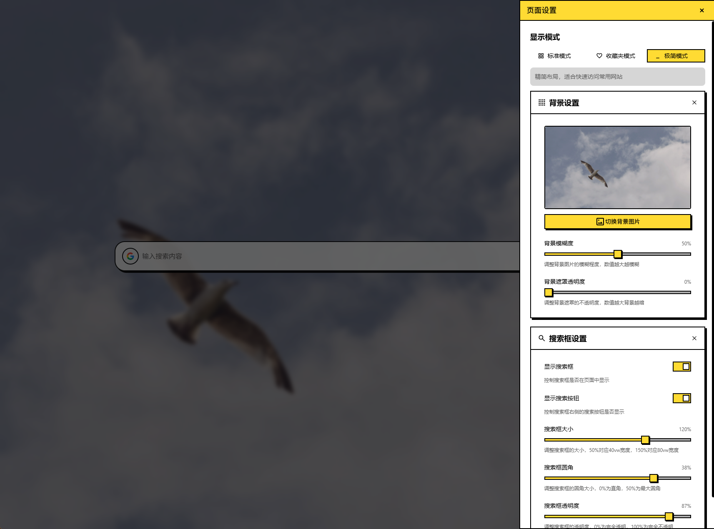

# Fan-new-tab 新标签页

## 介绍
这是我写的第一个浏览器插件，用于练习如何实现浏览器插件

它是一个新标签页插件，可以在新标签页中进行搜索和显示收藏的网页书签。通过美观的界面和丰富的自定义选项，让您的浏览体验更加愉悦。

## 效果展示

### 首页


### 设置


## 技术栈
- 🥝 [Vue3](https://vuejs.org/)
- 🦾 [TypeScript](https://www.typescriptlang.org/)
- 🧱 [Vite](https://vite.dev/)
- 🎨 [TailwindCSS](https://tailwindcss.com/)
- 🔍 [Iconify](https://iconify.design/)
- 📦 [Dexie.js](https://dexie.org/)

## 功能
- [x] 搜索功能
  - [x] 多搜索引擎支持
  - [x] 自定义搜索引擎
  - [x] 可调整搜索框大小和样式
- [x] 书签管理
  - [x] 显示收藏网站
  - [x] 添加/删除收藏站点
  - [x] 自定义分类
- [x] 主题设置
  - [x] 明/暗模式切换
  - [x] 自定义背景图片
  - [x] 背景模糊与透明度调整
- [x] 显示模式
  - [x] 标准模式 - 搜索框+网站网格
  - [x] 收藏模式 - 专注于收藏夹显示
  - [x] 极简模式 - 仅显示搜索框

## 安装方式

### 开发模式安装
```shell
npm install
npm run dev
```
1. 进入扩展程序，开启开发者模式
2. 点击加载未打包的扩展程序
3. 选择extension文件夹

### 从应用商店安装
~~1. 访问 Chrome 网上应用店~~
~~2. 搜索 "Fan-new-tab" 并安装~~

### 手动安装
~~1. 下载最新的 release 版本~~
~~2. 打开浏览器的扩展管理页面~~
~~3. 开启开发者模式~~
~~4. 拖入扩展文件完成安装~~